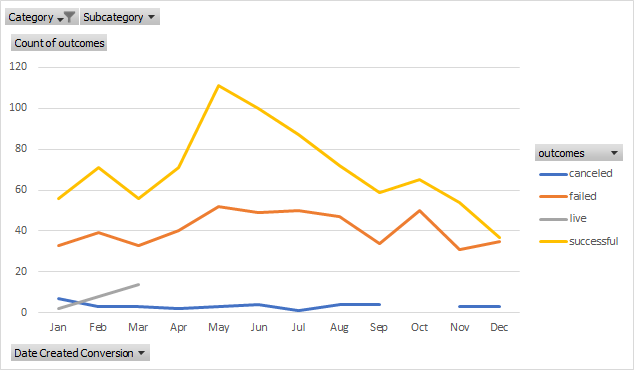

# Trend Analysis of Kickstarter Campaigns
---
This repo involves extensive analysis performed on raw Kickstarter Data using Excel to advise Louise on her idea to make a musical. Through the use of filters, trends involving fundraising as well as goals met were identified. For example, in the food industry, regardless of country, we see that food trucks did not meet their goal for fundraising:  
---
We can also see that there is a greater volume of plays requesting fundraising than other subcategories. Documentaries and rock music in specific fared extremely well when it came to success, as can be seen here: 
---
In terms of time of year that is suggestively beneficial for kickstarters, we can see that May is the best time of year, whereas Kickstarters in December seem to run into more obstacles:
---

---
Of the myriad of data, another telling factor is the goal amount in comparison to the reality of the dollars raised. The average goal for plays is ~$4000, while the average pledged is roughly $1000, with 50% of the data falling under $1500: 
---
Therefore, here is my advice to Louise: a hypothetical venture for Louise should be in May, with the data showing that her expected goal should be kept underneath $2000. This means that she has an expected budget of just under $2000 to make it happen, with a greater likelihood of success should she begin in May.
---
### Challenge Analysis
The challenge included figuring out the likelihood of success for the category of theater based on two filters: launch date and goal amount. The outcome of successful ventures based on goal amount trended in having a downward slope, meaning that the higher goals had a lower chance of success, as can be seen below. The outcome based on launch date for theater showed ventures have shown to do well in May.
---
 
---

---

